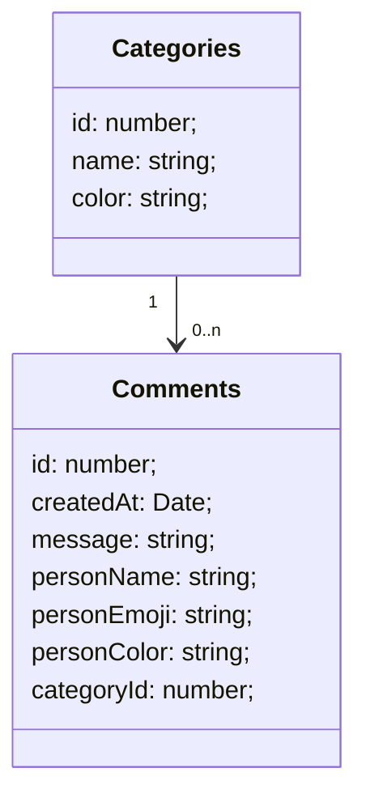

```mermaid

classDiagram

class Categories {
    id: number;
    name: string;
    color: string;
}

Categories "1" --> "0..n" Comments

class Comments {
    id: number;
    createdAt: Date;
    message: string;
    personName: string;
    personEmoji: string;
    personColor: string;
    categoryId: number;
}

```